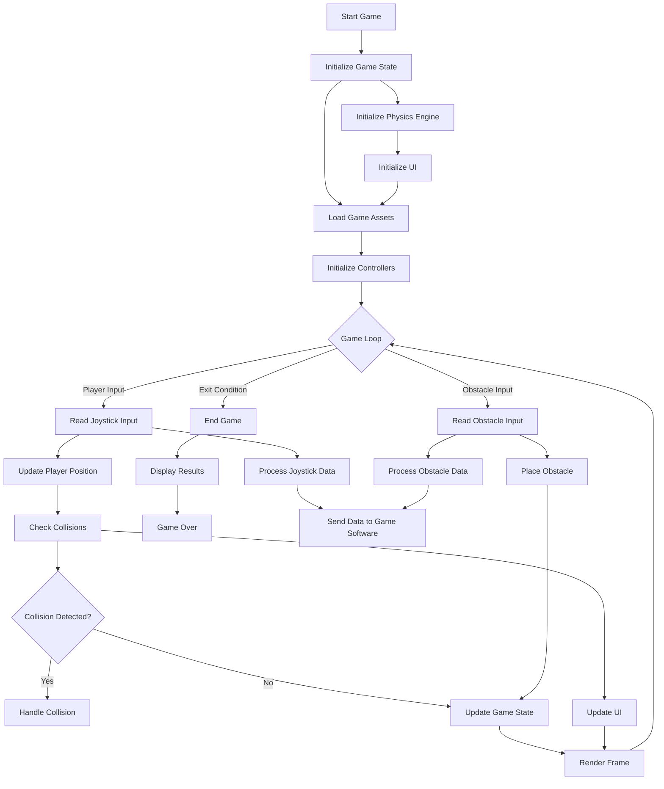
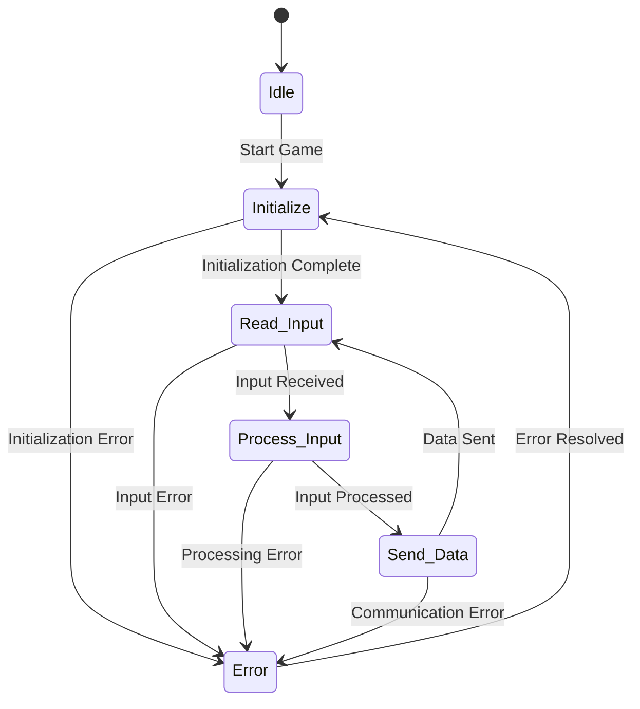

# obstacle-battle
 

```mermaid
flowchart TD
    A[Start Game] --> B[Initialize Game State]
    B --> C[Load Game Assets]
    C --> D[Initialize Controllers]
    D --> E{Game Loop}
    
    E -->|Player Input| F[Read Joystick Input]
    F --> G[Update Player Position]
    G --> H[Check Collisions]
    H --> I{Collision Detected?}
    I -->|Yes| J[Handle Collision]
    I -->|No| K[Update Game State]
    
    E -->|Obstacle Input| L[Read Obstacle Input]
    L --> M[Place Obstacle]
    M --> K
    
    K --> N[Render Frame]
    N --> E
    
    E -->|Exit Condition| O[End Game]
    O --> P[Display Results]
    P --> Q[Game Over]
    
    F --> R[Process Joystick Data]
    R --> S[Send Data to Game Software]
    L --> T[Process Obstacle Data]
    T --> S
    
    B --> U[Initialize Physics Engine]
    U --> V[Initialize UI]
    V --> C
    H --> W[Update UI]
    W --> N
```

# state diagram

```mermaid
stateDiagram-v2
    [*] --> Idle
    Idle --> Initialize : Start Game
    Initialize --> Read_Input : Initialization Complete
    Read_Input --> Process_Input : Input Received
    Process_Input --> Send_Data : Input Processed
    Send_Data --> Read_Input : Data Sent
    Initialize --> Error : Initialization Error
    Read_Input --> Error : Input Error
    Process_Input --> Error : Processing Error
    Send_Data --> Error : Communication Error
    Error --> Initialize : Error Resolved

```
